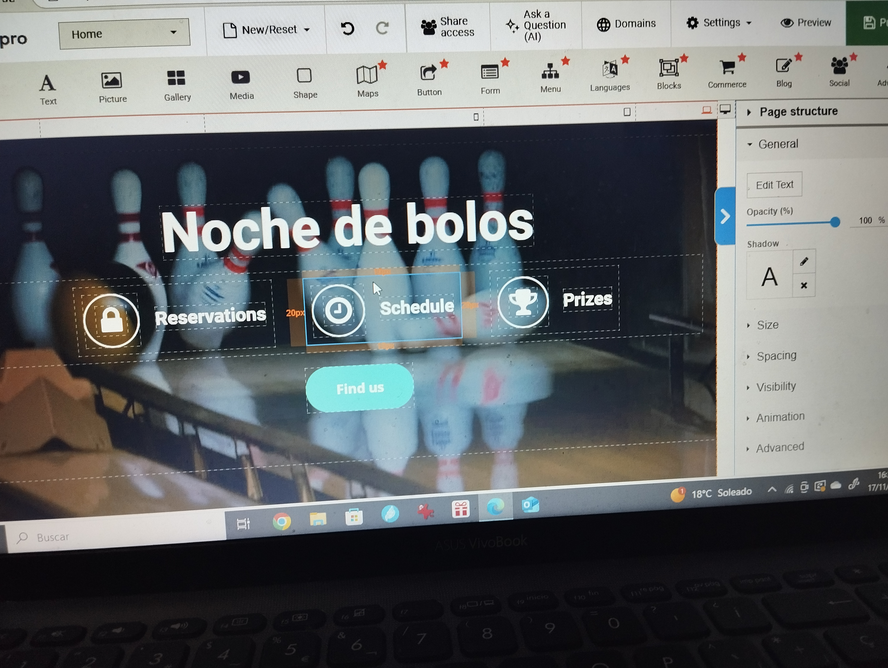
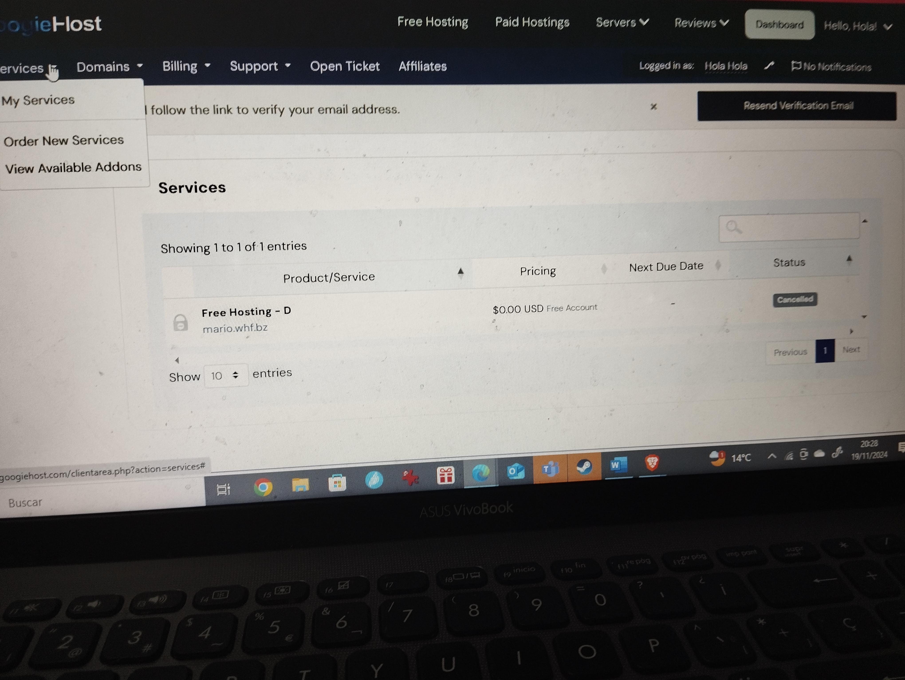
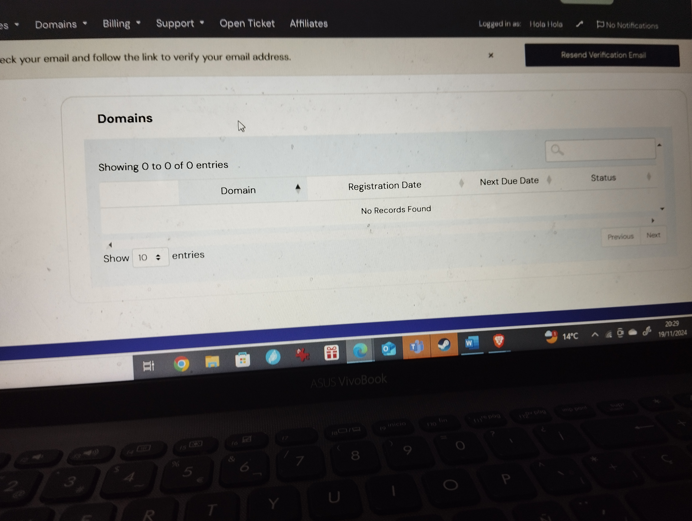
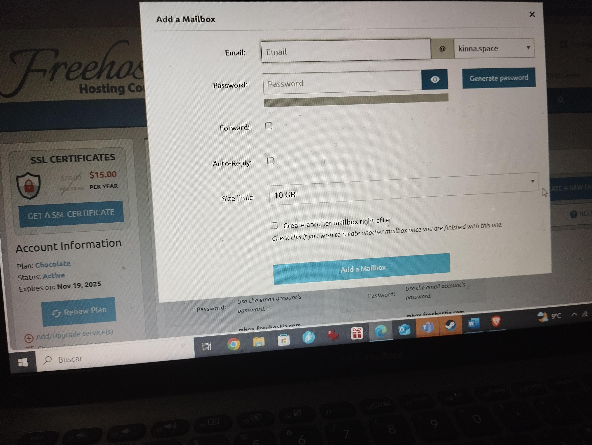
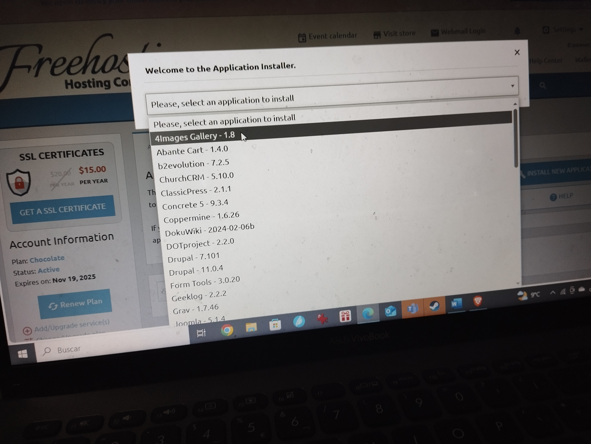

# Hostings gratuitos

En este Markdown enseñaré algunos servidores de hosting gratuitos.

## InfinityFree
Cuenta con un almacenamiento de 5 GB y ancho de banda ilimitado, solo permite subdominios, cuenta con certificado SSL y no cuenta con publicidad, aparte de esto, tiene soporte para PHP y MySQL.
## GoogieHost
Tiene un almacenamiento de 1 GB y un ancho de banda de 100 GB, puedes poner dominios y subdominios y tiene certificado SSL, no tiene anuncios y además tiene soporte para MySQL
## FreeHostia
Tiene un almacenamiento de 250 MB y un ancho de banda de 6 GB, cuenta con dominios, tiene certificado SSL y no tiene publicidad.
## Netlify
Tiene un almacenamiento de 300 MB y un ancho de banda de 100 GB, cuenta con dominios y subdominios, tiene certificado SSL y no tiene publicidad, además está sincronizado con GitHub
## Vercel
Cuenta con un almacenamiento ilimitado y con 100 GB de ancho de banda, permite dominios y subdominios, tiene certificado SSL y no tiene publicidad, además se sincroniza con GitHub, permitiendo subir repositorios.
# Tabla
| Provedor | Almacenamiento |Ancho de banda| Dominios y subdominios | Certificado SSL |Publicidad|Otras caracteristicas| Enlace| 
| -------------|-------------|-------------|-------------|-------------|-------------|-------------|-------------
| InfinityFree  | 5 GB| Ilimitado| Subdominios  | Si  | No |PHP y MySQL |[ InfinityFree](https://infinityfree.net/)
| GoogieHost| 1 GB| 100 GB| Dominios  | Si  |  No| MySQL | [GoogieHost](googiehost.com)
| Freehostia | 250 MB | 6 GB| Dominios  | Si  | No | MySQL |[FreeHostia](https://www.freehostia.com/)
| Netlify | 300 MB | 100 GB| Dominios  | Si  |  No |GitHub | [Netlify](netlify.com)
| Vercel  |  Ilimitado| 100 GB| Dominios  | Si | No | GitHub |[Vercel](vercel.com)

## InfinityFree
### Usuarios
En InfinityFree puedes crear usuarios, esto lo puedes hacer seleccionando la opción de accounts y seleccionar create account.

Como no queremos gastar dinero le daremos a la opción gratuita, la de la izquierda del todo.

Después de esto crearemos un dominio.

Y finalmente, pondremos información adicional, como la contraseña

### Certificados SSL
Para esto tendremos que ir a donde ponga **SSL Certificates** y le daremos a crear.

Después pondremos un nombre de subdominio y también en en opciones avanzadas, podemos poner un provedor de SSL.

### Página web

Para crear una página wevb tenemos que ir al apartado que pone **Site builders**.

Tenemos que ir abajo donde nos sale la opción de **go to site.pro**

Después de esto iniciamos sesión en la página, dándole clic a la opción de **crear página web**

Después de esto le daremos a edit website, eligiremos la plantilla que queramos, editamos la plantilla, y cuando quieras le das a publish

### Comprobar dominios 
Para comprobar dominios tendremos que dar a la opción de **domain checker**

Y después pondremos el nombre de dominio que queramos comrpobar y nos saldrá su estado

## GoogieHost
### Servicios
El primer apartado que nos sale en GoogieHost (sin contar Home), en este tenemos podemos ver nuestros servicios y ordenar nuestros servicios, en el cual podremos comprar (gratis) los servicios que tengamos (los dominios).

.

### Dominios
Dentro de el apartado **Domains** tenemos unas cuantas opciones para clicar, las cuales son:**my domains** para ver tus dominios **renew domains** para renovar dominios, **Register a new domain** para encontrar tus dominios y comprobar su disponibilidad y **transfer domains to us** para transferir dominios a la página web poniendo su nombre y su código de autorización

## FreeHostia
### Dominios
Puedes crear dominios en el apartado de **domains** y dándole al apartado **hosted domains**, después de esto le das a **create a subdomain** y podremos crear tanto un subdominio como un dominio de host.

Aparte de esto, puedes registrar y transferir dominios, esto lo haremos dándole otra vez al apartado de **domains**, pero ahora le daremos a la opción de **registered domains**, después de esto, le daremos a el botón que pone **REGISTER/TRANSFER DOMAIN**, al entrar pondremos el dominio que queramos.

### Mails
Podemos crear mails desde esta página, tendremos que darle al botón de **Email** y luego a **Mailboxes**, después, le daremos al botón de la derecha:**Create a new mail account**, después de esto ponemos los datos que queramos.

### Archivos y carpetas
Puedes crear tanto archivos como carpetas, para esto le daremos a donde ponga **Files** y luego a la opción de **File manager**, para crear o subir un archivo le daremos a la opción de **Upload new file** y para crear o subir una carpeta le daremos a la opcion de **Upload new folder**, cuando le demos a cualquiera de las opciones, se podrá crear un archivo/carpeta (depende de lo que hayas escogido) con el texto de arriba o subir un archivo de tu ordenador con la opción **add** (se verá de la misma manera tanto en la opción de carpeta como de archivo).

### Bases de datos 
Puedes añadir bases de datos de MySQL en esta página, para eso le daremos a la opción de **Databases** y luego a la opción de **MySQL Databases**, después le daremos a la opción de **add MySQL**, finalmente ponemos los datos que queramos, después de ponerlos nos saldrá abajo de la pantalla de antes.

### Aplicaciones 
Puedes instalar aplicaciones, para eso, le daremos a la opción de **Installer** y luego a **Aplications installer**, ya dentro, le daremos al botón que dice **Install new aplication**, después de eso, seleccionamos la que queramos instalar, y rellenaremos los datos que nos pidan.

##  Netlify
### Repositorios
Podemos subir los repositorios de GitHub, o crearlos con una plantilla, para esto, le daremos al botón **Sites** y escogeremos la opción la queramos, por ejemplo, yo escogeré, la de la izquierda, escogemos el programa donde tengamos el repositorio, sincronizamos nuestra cuenta de Netlify con la de GitHub, ponemos el repositorio que queramos y rellenaremos los datos que nos pide rellenar.

### Extensiones
Podemos instalar extensiones, le tendremos que dar a la opción de **Extensions** y escogemos la que queramos, finalmente la instalamos.

### Dominios
Podemos crear nuestros dominios dándole a la opción de **Domains** y darle a **Add or register a domain**, le pondremos un nombre, después aunque es opcional, podemos ponerle un registro de DNS, después, le daremos a **Done** y ya lo tendriamos.

## Vercel
### Subir repositorios de GitHub
Para subir repositorios de GitHub o GitLab tenemos que estar en el apartado y darle al apartado **Import project**, después de esto, selecionaremos una de las opciones disponibles y sincronizar tu cuenta de GitHub, GitLsab o BitBucket, depende de la que hayas escogido, después de eso, subirás el repositorio que quieras, y le daras a import, finalmente rellena los datos que se te pidan.

### Integraciones
Para instalarlas tenemos que ir al apartado **Integrations** y darle al botón **Browse integration**, después, escogeremos la integración que queramos, después de eso escogeremos una de las opciones disponibles, la que queramos, después de esto, rellena los datos que se te pidan y ya tendremos una integración.

### Dominios
Para los dominios, tendremos que darle al apartado **Domains** y darle a la opción **Add existing domain**, después de eso seleccionaremos una de las carpetas que nos salen por poner los repositorios de GitHub, después de eso le pondremos un nombre, cuando esté creada, nos saldrá la opción de **edit** y rellenamos la información como queramos.
